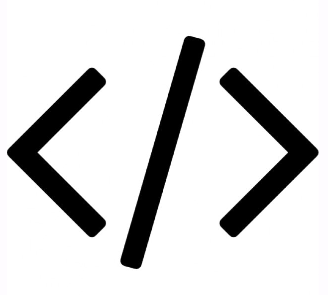

<!--

-->

 

  <h1 align="center">Discord Lyric-Bot</h3>

  

    [In Progress] Discord bot that sends lyrics of the day
     
    <a href="#">Invite Lyric-Bot</a>
  

## Table of Contents

- [Description](#description)
- [Getting Started](#getting-started)
    - [Prerequisites](#prerequisites)
    - [Installation](#installation)
- [Technical Stuff](#technical-stuff)
  - [License](#license)
  - [Acknowledgments](#acknowledgments)

---

# Description

Discord bot that sends lyrics of the day made with python.

This is just a temporary project I don't plan on continually maintaining it, use at your own risk.

# Getting Started

### Prerequisites

### Installation

# Technical Stuff

Built with <3

- Python

---

## License

Distributed under the MIT License. See `LICENSE` for more information.

## Acknowledgments

- 
